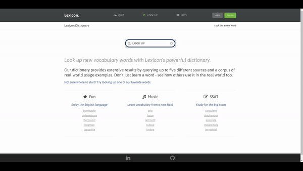
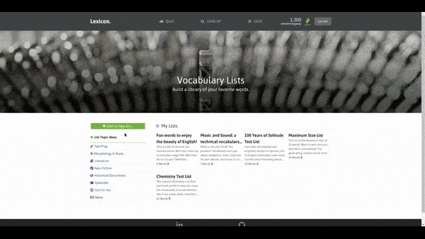
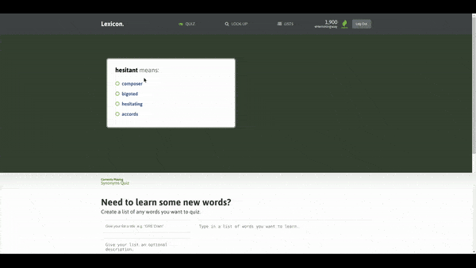

# Lexicon

[](https://travis-ci.org/dbodow/lexicon) [](https://coveralls.io/github/dbodow/lexicon?branch=master)

[Lexicon](http://lexiconly.herokuapp.com/) is a vocabulary study web app deeply inspired by [Vocabulary.com](http://www.vocabulary.com). It is
built on a Rails 5 backend with a PostgreSQL database, with a React/Redux
frontend.  

The web app allows users to:
* Search for words in a dictionary
* Create lists of words to study
* Quiz their understanding of words on their lists

## Table of Contents
* [Features (non-technical)](#features)
  * [Getting Started](#getting-started)
  * [Looking Up Words](#looking-up-words)
  * [Creating a Study Program](#creating-a-study-program)
  * [Quizzing Words](#quizzing-words)
* [Code Highlights (technical)](#code-highlights)
  * [Working with Word Data APIs](#working-with-word-data-apis)
  * [Using Animations to Improve UX](#using-animations-to-improve-ux)
* [Roadmap](#roadmap)
  * [Responsive Mobile Design](#responsive-mobile-design)
  * [List Search and Subscription](#list-search-and-subscription)
  * [Word Mastery](#word-mastery)

## Features
### Getting Started
Lexicon's *list* and *quiz* features require a user account.  

To register a free account, simply click the *Sign Up* button on the navigation header; no email address is required to register. Existing
users may log in to access word lists and take interactive quizzes.

### Looking Up Words
To search for a word, first click the *Look Up* link on navigation header.
Lexicon will direct you to a search bar.  

After submitting a search query, Lexicon will direct you to a word's definition page if the query is an exact match for a dictionary word. If
Lexicon cannot identify an exact match for a word, it will provide a
list of suggested queries.



### Creating a Study Program
While logged in, users can manage lists of words to build a vocabulary study program.  

First, click the *Lists* link on the navigation header. Lexicon will
direct you to an index of your word lists. From here, you can click a list
to view its words, manage its activation status, or delete it.

#### Creating Lists
Click on the *Start a New List* button on your lists index page to open a list creation form. In this form, add a list of up to 20 words to study, and click *Create List* to generate the study list. When the list is created, you will automatically be redirected to the list's show page.

Note that we must limit lists to a 20 word maximum to ensure a smooth user experience. For technical details on this limitation see [Working with Word Data APIs](#working-with-word-data-apis)



*Technical Digression: Parsing list words from the form:*  

*The list input form is parsed with a regular expression that splits the `<textarea>`'s string into an array words to query. The regex splits the string at any non-alphabetic, non-hyphen, non-apostrophe character.  

This allows users to input data in their preferred format and receive consistent results. For example, the form's auto-population provides comma-separated words, but whitespace separated or semicolon separated words would work just as well.*

```
wordsListToArray() {
  const words = this.state.wordsList.split(/[^A-Za-z'-]/).filter(Boolean);
  return Array.from(new Set(words));
}
```

#### Managing Lists

On a list's show page, you can also manage its activation status. When lists are created, they are automatically labeled as *active*. Only active lists are queried for words when using Lexicon's quiz feature.  

To deactivate a list, click the *Remove List from Study Program* button on the list's show page. This will remove the list's words from the quiz question pool without deleting the list. To reactivate it, click the *Add List to Study Program* button.  

If you wish to permanently delete the list, click the *Delete List* button.

### Quizzing Words

**Please refer to [Managing Lists](#managing-lists) to manage which words are included in your quiz program.**

While logged in, users can quiz themselves on words from their active lists. Click on the *quiz* link on the navigation header to proceed to the quiz page.  

To answer a question, click on the response item that best matches the question. To progress to the next question, click the button to the right of the quiz (this button will only appear contextually after a successful quiz response).  

Currently, only synonym questions are supported, but additional variety in question types may be implemented in a future release.



## Code Highlights

### Working with Word Data APIs

Lexicon's data is provided courtesy of two external word data APIs. Word definitions and examples are provided by [Wordnik](http://developer.wordnik.com/docs.html) while thesaurus data (for quiz questions) is provided by [Datamuse](http://www.datamuse.com/api/). I am profoundly grateful for the free access tiers provided by these APIs.

Integrating external data into Lexicon proved both rewarding and challenging. With access to these services' rich datasets, Lexicon can provide an engaging user experience directly from launch. However, because data is stored externally and must be fetched on user request, Lexicon needed to implement certain optimizations and constraints on users to ensure an acceptable user experience:

#### Caching Word Data

Wordnik's API allows only one word's definitions to be queried per request to `/word.json/{word}/definitions`. Further, fetching the word's example sentences require a second request to `/word.json/{word}/examples`. While this is not noticeable for fetching a single word, the latency from processing multiple requests for a full list of words can quickly add up. To minimize this latency when working with lists, Lexicon caches word data when it is requested for the first time. After caching, word lookup will first be attempted locally, with an API request generated only as needed.  

Consider these class methods from the `Word` model in `word.rb`:

```
def self.create_word(word)
  # check that the word exists
  # by assumption from the API, if a definition exists,
  # then data is available for that word.
  definitions = Word.fetch_definitions(word)
  return false if definitions.empty?

  # build word, definitions, and examples
  new_word = Word.create(word: word)
  word_id = new_word.id
  examples = Word.fetch_examples(word)['examples']
  Definition.create_definitions(definitions, word_id)
  Example.create_examples(examples, word_id)
  new_word
end

def self.find_by_word(word)
  # attempt to find the word in cached data
  result = Word.find_by(word: word)

  # create and cache the word if it does not already exist
  result ||= Word.create_word(word)
  result
end
```

#### Limiting Maximum List Size

While constructing long lists of existing words is quick from within Lexicon's backend (Lexicon need only insert an entry into the `list_words` joins table for each word), processing a large number of word creations using the Wordnik API is a significant bottleneck. To ensure that users can create lists within a reasonable amount of time (and also to rate limit users and avoid hitting Wordnik's free API 15,000 API call maximum), users are limited to submitting lists of at maximum 20 words. Currently, validation is run on the frontend which eliminates an extraneous HTTP request on failed validation:

```
// from new_list.jsx component
validateRequiredFields() {
  const errors = [];
  if (!this.state.title) errors.push("Title cannot be empty.");
  if (this.wordsListToArray(this.state.wordsList).length === 0) {
    errors.push("Please select some words for your list.");
  }
  if (this.wordsListToArray(this.state.wordsList).length > 20) {
    errors.push("Lexicon relies on a free API to locate data for our users' lists. Please limit yourself to only 20 words per list so that we can remain within our API call limit.");
  }
  if (errors.length !== 0) {
    alert(errors.join('\n'));
    return false;
  }
  return true;
}
```

Note that when data is available locally, the small list constraint becomes unnecessary. Try [creating a list](http://lexiconly.herokuapp.com/#/lists/new) of [twenty random words](https://www.randomlists.com/random-words), which has a typical server processing time of ~3 sec; then, try recreating the list with the same list of words. The second list creation should be nearly instantaneous.

In the longer term, at scale, Lexicon would ideally store all word data locally (though such data is costly). Word examples and collocates could ideally be sourced from the [COCA corpus](https://corpus.byu.edu/coca/). Definitions would ideally be sourced from a learner's dictionary to better target the educational market with easy to understand definitions and to enable other new features such as profanity filtering.

### Using Animations to Improve UX

Lexicon uses animations to create a smoother user experience, especially for answering quizzes. While these animations are mostly confined to fade-ins and container resizing on initial launch, they do require solid understanding of asynchronicity and the React lifecycle.

Fade-in animations are managed by a combination of CSS and the UI Reducer in Redux. Whenever an AJAX request is initiated that affects the user interface, Redux will first set the `ui` slice of state to `loading: true`. When the AJAX request promise is resolved, the UI slice of state is set to `loading: false`. For example, consider the following thunk action to fetch a word's definitions and examples:

```
// from word_actions.js
export const querySingleWord = query => dispatch => {
  dispatch(setUILoading());
  return ( WordAPIUtil.querySingleWord(query)
    .then(entities => dispatch(receiveWordData(entities)))
    .fail(errors => dispatch(receiveEntitiesErrors(errors.responseJSON)))
    .always(() => dispatch(clearUILoading()))
  );
};
```

The associated loaded element has its CSS initially set to `opacity: 0;`, `visibility: hidden;`, and `transition: 0.2s;`. When the AJAX is resolved, React inserts a new className overriding this with `opacity: 1;` and `visibility: visible;`, creating a pleasant fade-in effect.  

More complex fade-in and animation logic can be calculated in a similar way. For example, the Quiz component manages a state with the following default properties:

```
{
  isLastQuestionCorrect: false,
  lastGuessStatus: PRISTINE,
  answerLoaded: false,
  clickedGuesses: []
}
```

By updating `isLastQuestionCorrect` (measures whether the answer was guessed on the first try), `lastGuessStatus` (measures whether the most recently clicked answer was correct), `answerLoaded` (measures whether the solution text has finished loading in), and `clickedGuesses` (measures which answers were clicked in a set-like array), the page can precisely manage different animations and fades (e.g. default color to red/green for a clicked answer), creating a more seamless user experience.

## Roadmap

### Responsive Mobile Design

Lexicon is currently optimized for displays at least 1025px wide. A priority enhancement is to write media queries to allow responsive styling on mobile displays.  

Estimated completion date: January 2018

### List Search and Subscription

In a future release, users will be able to share lists with each other and search for pre-made lists. For example, a student in a literature class could search for a list based on the title of a book they are reading and subscribe without needing to design his or her own list.  

Lexicon's backend was designed with this future feature in mind. List subscription is currently managed in a `user_lists` joins table instead of storing the foreign key directly in the lists table; subscribing to a list will simply require adding a new entry to this joins table, as well as a `list_owner` foreign key for filtering owned lists vs. subscribed lists.

### Word Mastery

Currently, Lexicon does not track users' mastery of individual words. When a quiz question is correctly answered on a first attempt, only the user's points are incremented.

Tracking word mastery will require creating a `user_word` joins table with `effort_factor` (measure of aggregate progress) and `response_quality` (measure of user's success on most recent response) columns. The initial version of this feature will simply increment mastery on successful quiz responses as proof of concept, while later iterations may allow quizzes to more intelligently generate questions based on `effort_factor` (e.g. through implementation of spaced repetition / [SuperMemo 2](https://www.supermemo.com/english/ol/sm2.htm))
